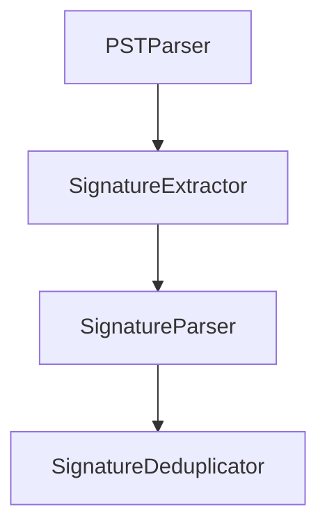

# Signature Block Recovery

This repository will contain tooling for extracting or reconstructing signature blocks from various data sources. The project is currently in its planning phase.

## Features

- Documentation outlining the project goals and future development steps.
- Guidelines for Codex automation via `AGENTS.md`.

## Quick-Start (GUI or CLI)

### GUI Installation

1. **Download the Installer**  
   Visit our [GitHub Releases page](https://github.com/YourOrg/Signature-Block-Recovery/releases) and grab the latest:  
   - `SignatureRecoverySetup.msi` for Windows  
   - `SignatureRecovery.dmg` for macOS

2. **Install**  
   - **Windows:** Double-click the `.msi`—no admin rights needed.  
   - **macOS:** Open the `.dmg` and drag “Signature Recovery” into Applications.

3. **Launch**  
   - Click the desktop icon (Windows) or open from Launchpad (macOS).

### CLI Installation & Usage

If you prefer the command line or need scripting:

```bash
pip install signature-recovery
```

* **Extract** signatures:

  ```bash
  recover-signatures extract --input my.pst --index sigs.db
  ```
* **Query** the index:

  ```bash
  recover-signatures query --index sigs.db --filter "john.doe"
  ```
* **Export** results:

  ```bash
  recover-signatures export --index sigs.db --format csv --output signatures.csv
  ```
* **GUI** from CLI:

  ```bash
  recover-signatures gui --index sigs.db
  ```
* **Help** and flags:

  ```bash
  recover-signatures --help
  ```

---

## Core Architecture



### Extraction Parameters

Configuration is loaded from a YAML file. Copy `config.example.yaml` and adjust
patterns or fallback line counts as needed:

```yaml
extraction:
  max_fallback_lines: 5
  signoff_patterns:
    - "--\s*$"
    - "regards"
parser:
  phone_patterns:
    - "\(\d{3}\)\s*\d{3}-\d{4}"
```
