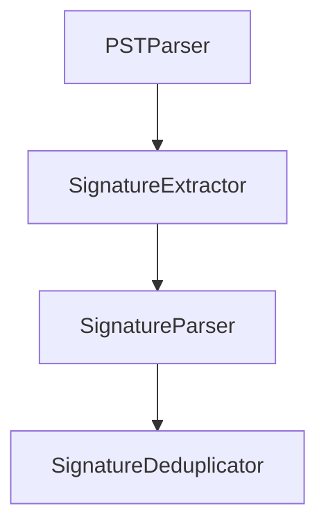

# Signature Block Recovery

This repository will contain tooling for extracting or reconstructing signature blocks from various data sources. The project is currently in its planning phase.

## Features

- Documentation outlining the project goals and future development steps.
- Guidelines for Codex automation via `AGENTS.md`.

## Getting Started

The project now contains initial implementation of the core modules.

### CLI Usage

Run the extractor in headless mode:

```bash
python -m signature_recovery.cli.main --input path/to/mail.pst --output signatures.db
```

A minimal Tkinter GUI can be launched via `python -m signature_recovery.gui.app`.

## Core Architecture



### Extraction Parameters

Configuration is loaded from a YAML file. Copy `config.example.yaml` and adjust
patterns or fallback line counts as needed:

```yaml
extraction:
  max_fallback_lines: 5
  signoff_patterns:
    - "--\s*$"
    - "regards"
parser:
  phone_patterns:
    - "\(\d{3}\)\s*\d{3}-\d{4}"
```
