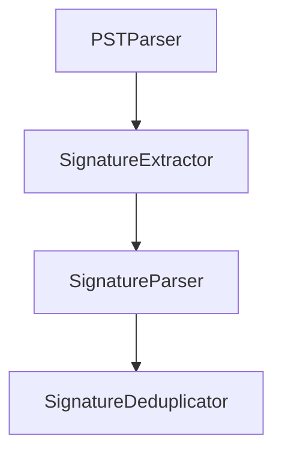

# Signature Block Recovery

This repository will contain tooling for extracting or reconstructing signature blocks from various data sources. The project is currently in its planning phase.

## Features

- Documentation outlining the project goals and future development steps.
- Guidelines for Codex automation via `AGENTS.md`.

## Quick-Start (GUI Only)

1. **Download & Install**  
   - **Windows:** Run `SignatureRecoverySetup.msi`, then double-click the desktop icon.  
   - **macOS:** Open the `.dmg` and drag “Signature Recovery” to Applications.  

2. **First-Time Setup**  
   - On launch, point to your PST file(s) and choose where to save the index.  
   - Extraction will run automatically; wait for “Extraction Complete”.

3. **Search & Export**  
   - Use the search box, adjust filters/confidence, then click **Export** to CSV/JSON/Excel.  

## Core Architecture



### Extraction Parameters

Configuration is loaded from a YAML file. Copy `config.example.yaml` and adjust
patterns or fallback line counts as needed:

```yaml
extraction:
  max_fallback_lines: 5
  signoff_patterns:
    - "--\s*$"
    - "regards"
parser:
  phone_patterns:
    - "\(\d{3}\)\s*\d{3}-\d{4}"
```
