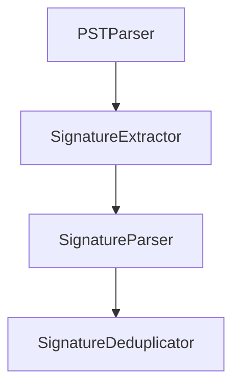

# Signature Block Recovery

This repository will contain tooling for extracting or reconstructing signature blocks from various data sources. The project is currently in its planning phase.

## Features

- Documentation outlining the project goals and future development steps.
- Guidelines for Codex automation via `AGENTS.md`.

## Getting Started

The project now contains initial implementation of the core modules.

### CLI Usage

The project ships a `recover-signatures` command line tool with three subcommands.
Check the version at any time using:

```bash
recover-signatures --version
```

Run extraction on a PST file and build an index:

```bash
recover-signatures extract --input mail.pst --index sigs.db --threads 4 --batch-size 500
```

Search the index for a term:

```bash
recover-signatures query --index sigs.db --q "John Doe" --page 1 --size 5
```

Export all signatures to CSV:

```bash
recover-signatures export --index sigs.db --format csv --out sigs.csv
```

Global flags such as `--threads`, `--batch-size`, `--min-confidence`, `--metrics`,
and `--dump-metrics metrics.json` apply to all subcommands and control filtering
and performance reporting.

A Tkinter GUI can be launched via `python -m signature_recovery.gui.app`.

## GUI Usage

```
┌─────────────── Search ────────────────┐
│ [ query ________ ] [ Search ]          │
├────────────── Filters ────────────────┤
│ Start [YYYY-MM-DD] End [YYYY-MM-DD]   │
│ Company [multi-select]                │
│ Title   [multi-select]                │
├────────────── Results ────────────────┤
│ Name | Company | Title | Date | Conf. │
│---------------------------------------│
│ ...                                   │
├──────────── Pagination ───────────────┤
│ [Prev] [Next] PageSize [5▼] Page X/Y  │
└───────────────────────────────────────┘
```

Use the search box to query the index. Filters can narrow results by date range,
company, or title. Column headers are clickable to sort ascending/descending.
Pagination controls step through result pages and adjust the page size.

## Core Architecture



### Extraction Parameters

Configuration is loaded from a YAML file. Copy `config.example.yaml` and adjust
patterns or fallback line counts as needed:

```yaml
extraction:
  max_fallback_lines: 5
  signoff_patterns:
    - "--\s*$"
    - "regards"
parser:
  phone_patterns:
    - "\(\d{3}\)\s*\d{3}-\d{4}"
```
